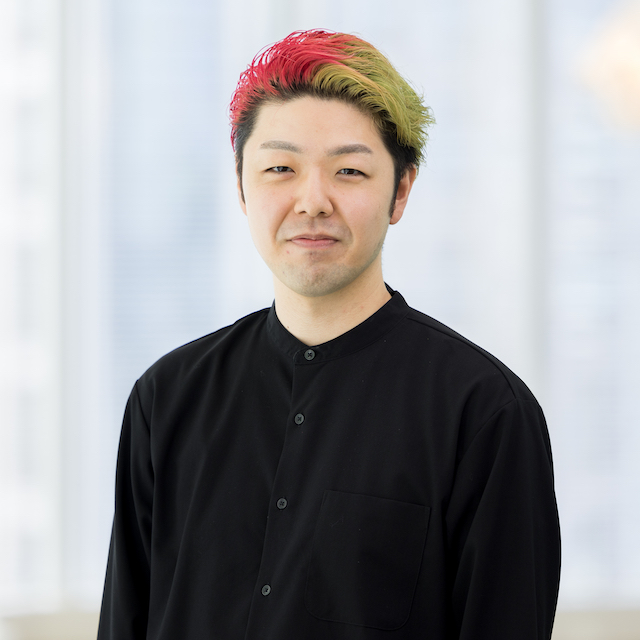
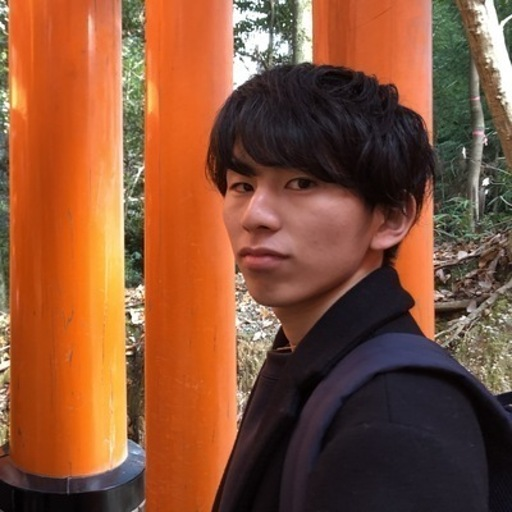

## 概要

[堅牢.py](https://kenro.connpass.com/event/371009/) はPythonを安全に扱うための技術に興味を持つエンジニアのイベントです。今回が初開催です!!

## :ticket: 参加枠

- 登壇枠: 15分のショートセッションを行う方向けの枠です
- 現地参加枠: 現地参加される方向けの枠です

## :stopwatch: スケジュール

- 18:30 開場
- 19:05 挨拶・会場案内
- 19:15 スペシャルゲストによるトークセッション
- 19:35 ショートセッション (15分 x 4)
- 20:35 退室

## :microphone: セッション

15分のショートセッションを披露していただきます。本イベントのテーマである「堅牢にPythonプログラムを作成する技術」について思う存分語ってください!!

テーマ例:

- Typing Module
- Package Manager, Lockfile
- 静的解析, 実行時型解析
- 非同期処理
- その他、Pythonプログラムの堅牢性に貢献する知見

## :speech_balloon: 登壇者

### しゅんけー (@shunk031)

- 経歴：LINEヤフー株式会社リサーチサイエンティスト・法政大学大学院特任研究員。2023年3月に法政大学大学院理工学研究科を修了。博士（工学）。日本学術振興会特別研究員（DC2）を経て現職。コンピュータービジョンや自然言語処理を始め、その融合領域であるVision&Language分野にて研究に従事。現在はユーザーにとって魅力的な画像やデザインの作成を支援するような最先端技術の研究開発に携わる。著書に「Pythonで学ぶ画像生成」（単著・インプレス社）がある。個人ページ: https://shunk031.me

### ころんびあ (@colum2321)

- タイトル: 「numpyやPyTorchの配列にdtypeとshapeをアノテーションするjaxtypingのススメ」
- 経歴: 九州大学大学院在学中に国際的なデータ分析コンペティションのKaggleに取り組みKaggle Competitions Masterを取得。2023年に完全自動運転AIの開発を目指すチューリング株式会社にMLエンジニアとして入社。現在はMLOpsエンジニアとして、社内の機械学習基盤やデータセット、評価の開発を行う。好きなツールはuv。

## :clinking_beer_mugs: 懇親会

非公式の懇親会を行う予定です。

- 参加方法: Connpassの事前アンケートで「懇親会に参加する」に「はい」と回答してください
- 費用: 懇親会は一人あたり3500円-5000円程度を想定しています。

## :round_pushpin: 会場

[株式会社ユーザベース](https://www.uzabase.com)様に会場をスポンサードいただいております。

住所: 東京都 千代田区 丸の内2-5-2 三菱ビル

- JR各線 東京駅 丸の内南口より徒歩2分
- 東京メトロ丸ノ内線 東京駅地下道経由徒歩3分
- 東京メトロ千代田線 二重橋前駅 4番出口より徒歩2分
- 東京メトロ東西線 大手町 B1出口より徒歩6分
- 都営三田線 大手町 D1出口より徒歩4分

詳細: https://www.uzabase.com/jp/company/

## :warning: 注意事項

本イベントでは下記の行動規範に基いた行動をお願いします。違反された行為を確認された場合、同意なく退出していただくことがございます。

- https://github.com/kenro-dev/kenro-dev/tree/main/code-of-conduct
